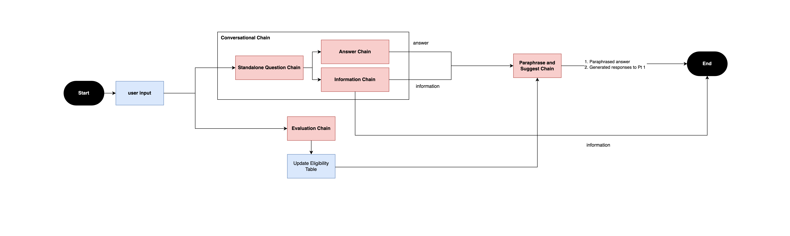

# 1. Eligiblity Criteria

## 1.1 Right now and future hope

- Right now, it is able to nudge the conversation towards asking the criteria that have yet to be answered by the user
- In the future, the hope is that service providers will setup said criteria by uploading the documents, the app will read that in, translate it into criteria for the funnelling of conversation to happen
- We can create multiple criteria enums for mulitple context and possibly give weights to each of them

## 1.2 How it works

- This happens in the evalutaion chain
- A Eligiblity Table is first created with a pre-loaded set of criteria custom to the domain. The table maps the criteria to the rubric on which a user input will be evaluated on
- User input is passed into a classifier chain
- This classifier chain classifies the input based on the criteria provided
- With this criteria, it will be evaluated upon dynamically and Daisy will decide whether the user input meets the criteria rubric
- For eg. The input "My grandmother fell and she is in a wheelchair, and I don't know what to do." would result in the classification of the criterion "ACCIDENT", and value of "Y". This means that the Daisy is able to classify the nature of the user's input.

```typescript
user_input = {
    "message": "My grandmother fell and she is in a wheelchair, and I don't know what to do"
}


evaluation_chain_output = {
    "criteria": "ACCIDENT",
    "reasoning": "The user's grandmother has fallen and is now in a wheelchair, which suggests that there may have been an accident.",
    "value": "Y"
}

class CriteriaEnum(str, Enum):
    """The types of the Criteria."""
    LOW_INCOME = "Is the user or the person in question considered low income?"
    LOW_FINANCIAL_AND_OR_LEGAL_LITERACY = "Does the person in question demonstrate a limited understanding of fundamental financial and/or legal concepts?"
    FAMILY_OF_PWD = "Is the person in question a family of a person with disability?"
    ACCIDENT = "Was the user or person in question recently in an accident?"
    ...
```

## 1.3 The eligiblity table is updated with the classification result

| criteria   | evaluation |
| ---------- | ---------- |
| ACCIDENT   | True       |
| LOW_INCOME | None       |


# 2. Dynamic Context Hub

This is produced from the `information_chain`

## 2.1 How it works
- Daisy first creates a topic based on the nature of the user input in the `standalone_question_chain` and passes it to the `information_chain`
- Daisy grabs relevant documents using the refined standalone question
- With the following, Daisy will generate information using COT for the Dynamic Context Hub
  - Topic
  - Relevant documents
  - Refined standalone question
- To understand more of the COT Implementation, refer to the sub-section "Chain of Thought implementation" below
- The answer is a JSON output of InfoItems. Each InfoItme consists of a `title` and `content`. Due to the consistent output of keys, we are able to map these values accordingly into the visual hierachy.
- Learn more about the JSON implementation in the sub-section "Enforcing JSON output for consistent frontend rendering" below


## 2.2 De-duplication of generated information over multiple dialogue turns
- This implementation is a naive method due to the lack of time. Ideally, we would have wanted Daisy's backend to handle de-duplication of information
- As the conversation progresses, there might be duplicate topics being returned from the backenda and this cluster's the user's viewport
- Additionally, due to the nature of LLMs, phrases can come in different forms but mean the same thing. For eg, the topic "Home Caregiving Grant (HCG)" and "Home Caregiving Grant (HCG) Programme" are the same to humans.
- In attempt to declutter and de-duplicate information, we used applied levenshtein distance on the topic (ie. Home Caregiving Grant) and each of the sub-topics (ie. About the grant, Benefits, How to apply, etc.) to match semantically similar words
- If the words are not semenatically similar, we then proceed to update the section 


## 2.3 Chain of Thought implementation
- This is a process of teaching the LLM how to approach the problem. 
- We noticed that a simple prompt template would require n number of liners to n number of specific problems
- COT allowed Diasy to implement an analytical approach to the problem
- In the `information_chain`, it first checks whether the user input is about grants. Otherwise, it will be treated as a generic question
- If it is about grants, Daisy will output fixed sub sections with the corresponding descriptions
- If it is a generic question, Daisy will respond accordingly

## 2.4 Enforcing JSON output for consistent frontend rendering 
- `JsonOutputParser` from langchain is used
- We are able to separate output formatting from the prompt, making the code cleaner
- Using langchain's partial variables, we are able to define the output structure and pass it into the prompt 

```python
class StandaloneQuestionOutput(BaseModel):
    """Typings for standalone question output item"""
    topic: str = Field(
        description="This the main topic of the refined standalone question.")
    standalone_question: str = Field(
        description="This is the refined standalone question.")


STANDALONE_TEMPLATE = """Your task is to ...

...additional template information...

// This is where the JSON output is embedding
{format_instructions}
"""
```
- `StandaloneQuestionOutput(BaseModel)` class is used to describe that the output required from this chain is to be a dictionary with the below two keys:
  - topic
  - standalone_question
- We are able to describe the value of these keys as well
- Being able to manifest data manipulation of the LLMs output has lots of benefits, we are able to pass this heavy lifting to Langchain. The alternative might have been to invoke the LLM multiple times, which is just not performant

# 3. Conversational Panel

# 3.1 Answer generation
- Refer to the <b>Section 4</b> as this is part of the overall chain flow

## 3.2 Suggested human responses
- As users might not be well-versed in the topic, Daisy helps by suggesting responses that are aligned with the  conversational topic
- This responses also takes into account the overall intent of checking if a user is eligible for the specified grant
- This is implemented using COT
- Using langchain's `JsonOutputParser`, we are able to map these responses in the corresponding location in Conversational Panel

# 4. Overall chain flow


4.1 `conversational_retrieval_chain`
4.1.1 `standalone_question_chain`
4.1.2 `answer_chain`
4.2 `evaluation_chain`
4.2.1 `classifier_chain`
4.2.2 `evaluation_chain`
4.3 `paraphrase_and_suggest_chain`
4.4 `composite_chain`


# 5. Syncing with the Conversation Panel (Right side)
- On each dialogue turn, Daisy is able to sync the current topic in both the Left and Right Panels (ie. Dynamic Context Hub and Conversational Panel)
- We do so by leveraging on the `topic` generated from the `standalone_question_chain`
- This `topic` is tagged to the relevant information panel in the Dynamic Context Hub, which will then be leveraged to scroll said panel into view
- The Conversational Panel will always scroll to the latest dialogue turn which is consistent with the corresponding information panel in Dyanmic Context Panel as the same `topic` is being used
